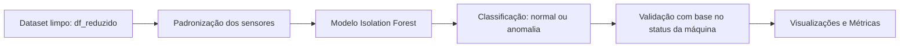

# Detecção de Anomalias em Bomba d'Água com Isolation Forest

Este projeto tem como objetivo aplicar técnicas de aprendizado não supervisionado para detectar anomalias operacionais em bombas d'água industriais, com base em séries temporais multivariadas provenientes de sensores analógicos. A aplicação permite identificar comportamentos fora do padrão que antecedem falhas, auxiliando na manutenção preditiva e na antecipação de intervenções corretivas.

## Objetivo

Utilizar o algoritmo **Isolation Forest** para identificar padrões anômalos de funcionamento em tempo real, com foco em detectar **instabilidades operacionais antes da falha total da bomba**. O projeto busca oferecer um modelo leve, interpretável e aplicável em ambientes industriais.

---

## 1. Análise Exploratória e Insights

Foi realizada uma análise detalhada dos sensores, incluindo:

- Correlação entre sensores (detecção e remoção de colunas redundantes com `|corr| > 0.85`)
- Distribuição de valores por classe operacional (`NORMAL`, `RECOVERING`, `BROKEN`)
- Comportamento dos sensores antes e depois de falhas
- Análise visual de segmentos pós-falha (recuperação) com instabilidade

**Principais descobertas:**

- Sensores altamente correlacionados foram removidos para evitar redundância.
- O estado `RECOVERING` apresenta grande instabilidade nos sensores, o que justificou sua identificação como anômalo.
- Após a recuperação, os sensores levam tempo para estabilizar, indicando risco de falha recorrente.

---

## 2. Pipeline de Modelagem

### Pré-processamento

- Exclusão de colunas redundantes com base em correlação.
- Padronização dos sensores com `StandardScaler`.
- O dataframe `df_reduzido` contém apenas sensores numéricos tratados.

### Modelagem

- Algoritmo: `IsolationForest` com `contamination=0.01`
- Dataset completo utilizado (sem split) devido à natureza não supervisionada
- Predições binárias: **1 = normal**, **-1 = anomalia**

---

## 3. Métricas e Resultados

 **Distribuição de Anomalias por machine_status:**

| Status       | % de Anomalias |
|--------------|----------------|
| NORMAL       | 3.67%          |
| RECOVERING   | 92.37%         |
| BROKEN       | 28.57%         |

 **Últimas 1000 anomalias:**

- 901 ocorrem em `NORMAL`
- 99 ocorrem em `RECOVERING`
- Nenhuma ocorreu durante `BROKEN`, validando a antecipação do modelo.

 **Análise temporal:**

- **Tempo médio entre anomalia e falha:** 37.9 minutos
- **% de falhas precedidas por anomalias (últ. 60 min):** 28.6%

O modelo se mostrou eficiente em antecipar comportamentos anômalos com razoável antecedência. Apesar de algumas falhas não apresentarem anomalias claras, os sensores demonstraram instabilidade após o `RECOVERING`, e o modelo capturou essas transições com sucesso.

---

## 4. Visualizações Geradas

- Gráfico temporal com anomalias destacadas (`sensor_14`)
- Gráficos individuais por sensor nos minutos anteriores à falha
- Análise de comportamento dos sensores após o `RECOVERING`
- Gráfico de tempo de operação entre falhas

---

## 5. Conclusão

O modelo Isolation Forest demonstrou ser eficaz para identificar comportamentos fora do padrão **antes de falhas críticas**. A elevada detecção de anomalias no estado `RECOVERING` evidencia que, mesmo após a correção, o equipamento permanece em zona de risco.

Com visualizações claras, análise temporal e insights interpretáveis, este projeto representa uma solução viável e leve para monitoramento contínuo de ativos industriais. A abordagem não supervisionada foi adequada, dada a escassez de rótulos de falha em tempo real.

---

## Requisitos

As bibliotecas utilizadas estão listadas em `requirements.txt`, incluindo:

- pandas  
- numpy  
- matplotlib  
- seaborn  
- scikit-learn  
- plotly  

---

## Execução

O notebook contém toda a análise, modelagem e gráficos. Pode ser executado em ambiente Jupyter ou Google Colab.

## Autor

**Heitor Tonet**  
Engenheiro de Controle e Automação e Cientista de Dados, com foco em manutenção preditiva industrial, especializado em modelos de RUL, detecção de falhas, séries temporais e simulações baseadas em física.

## Licença

MIT License
